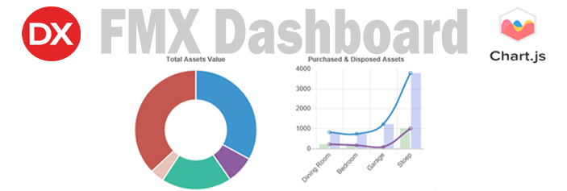
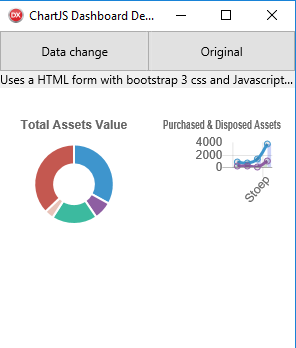
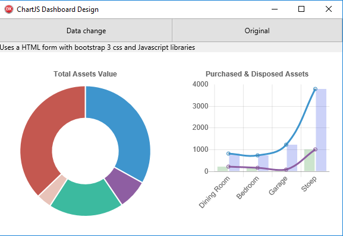

**Background**

Combining JavaScript into your Delphi FMX or VCL App can give you quick results.
The Chart.js JavaScript library is an easy to use graph library which is
responsive and gesture interactive in nature making for a professional result.

**IDE**

Tokyo 10.2 used, this should be backwards compatible to Berlin 10.1 version as
it makes use of the newer updated browser and the EvaluateJavaScript procedure.

**Scope**

Demonstrate how to update the JavaScript [Chart.JS](http://www.chartjs.org/)
with Delphi Actions by running the graphs in the Web Browser. Use the browser
EvaluateJavaScript procedure (as of Berlin 10.1 ) to update the browser Charts.
Ensure that the browser is fully responsive thereby allowing easy compiling to
Windows and Mobile.

**Requirements**

Standard FMX Library used and or the VCL Library.

[ChartJS](http://www.chartjs.org/).

[Bootstrap](https://getbootstrap.com/) 3. ( Bootstrap 4 not compatible currently
with Chart.JS).

Html, CSS3.

Difficulty level :-

An understanding of HTML, CSS and Javascript will help.

**Method**

The TWebBrowser component serves as the Dashboard container for the Chart.JS
library objects.

A HTML form (index.html) is created and this contains the CSS and JS to be
loaded and is called via the URL File function when the main form is shown.

The chart JS id’s are set in order for the Donut and Bar-chart can be rendered
in the html page.

\<code\>

\

\<canvas id="doughnut-chart" width="20" height="20"\>\</canvas\>

\</div\>

\

\<canvas id="mixed-chart" width="20" height="20"\>\</canvas\>

\</div\>

\</code\>

So why not call the CSS or JS directly from the App without using HTML forms
directly? This method will not render the CSS or JS in the Web Browser.

Currently Bootstrap 4’s and flexbox is not fully compatible with Chart.JS. So
until Chart.js has been updated, we make use of the older Bootstrap 3 which
renders the Web Browser data responsive using the Bootstraps’
\<div\>container\</div\>.

**Issues overcome**

When calling the EvaluateJavaScript procedure, the Web Browser does not refresh
the original data but somehow overlays the data to the Web Browser. The mouse-
over events triggers previously loaded changes which results with two or more
different results as the mouse is dragged over the JavaScript object.

To overcome this we reload the HTML by reloading the Web Browser. A TTimer calls
the EvaluateJavaScript procedure.

So why use a TTimer set to 200 microseconds? It gives the Web Browser sufficient
time to reset and clear all the local data that was stored in memory before
reloading.

One might think that it would be easier to thread (TThread) this process however
the TTimer works best for this process.

The code is straight forward and here is a snippit of code for calling the
EvaluateJavascript procedure.

\<Delphi code\>

procedure TForm4.webbrowserstart;

var

clabels,cbackgroundcolor,cdata,mlabels, mdata1, mdata2,mdata3,mdata4 :string;

updategraph:string;

begin

clabels:= '["Upstairs", "Outside", "Bedroom3", "Garage", "Dining Room"],';

cbackgroundColor:= '["\#3e95cd", "\#8e5ea2","\#3cba9f","\#e8c3b9","\#c45850"],
';

cdata:='[890,200,500,100,1000]';

mlabels:= ' ["Dining Room", "Bedroom", "Garage","Stoep"], ';

mdata1:= '[200,140,70,1000],';

mdata2:= '[800,720,1220,3800],';

updategraph :=

'new Chart(document.getElementById("doughnut-chart"), {'

\+' type: "doughnut",'

\+' data: {'

\+' labels: '+clabels

\+' datasets: ['

\+' { '

\+' label: "Rooms",'

\+' backgroundColor:' +cbackgroundcolor

\+' data: ' +cdata

\+' } '

\+' ] '

\+' }, '

\+' options: { '

\+' legend: { display: false }, '

\+' title: { '

\+' display: "True", '

\+' text: "Total Assets Value" '

\+' } '

\+' } '

\+'});'

\+'new Chart(document.getElementById("mixed-chart"), { '

\+' type: "bar", '

\+' data: { '

\+' labels: '+ mlabels

\+' datasets: [{ '

\+' label: "Purchased", '

\+' type: "line", '

\+' borderColor: "\#8e5ea2", '

\+' data: '+mdata1

\+' fill: false '

\+' }, { '

\+' label: "Disposed", '

\+' type: "line", '

\+' borderColor: "\#3e95cd", '

\+' data:' +mdata2

\+' fill: false '

\+' }, { '

\+' label: "Purchased", '

\+' type: "bar", '

\+' backgroundColor: "rgba(0,120,5,0.2)", '

\+' data: '+mdata1

\+' }, { '

\+' label: "Disposed", '

\+' type: "bar", '

\+' backgroundColor: "rgba(0,30,220,0.2)", '

\+' backgroundColorHover: "\#3e95cd", '

\+' data: '+ mdata2

\+' } '

\+' ] '

\+' }, '

\+' options: { '

\+' title: { '

\+' display: true, '

\+' text: "Purchased & Disposed Assets" '

\+' }, '

\+' legend: { display: false } '

\+' } '

\+'}); '

;

WebBrowser1.EvaluateJavaScript(updategraph);

end;

\</Delphi code\>

Whilst this demo only used two Buttons to simulate changing data, calling fast
changing data would be easily implemented by replacing the buttons with a single
timer that would refresh the Web Browser Dashboard in real-time.

Below are two images showing how the browser views the Chart objects. As can be
seen, they are automatically responsive in nature. So compiling to Android and
Windows requires no changes on your part.

This app will compile to Android. Follow the Android procedure to compile and
deploy the App to your device.

Feel free to download the full source for this demo.

Happy Coding
